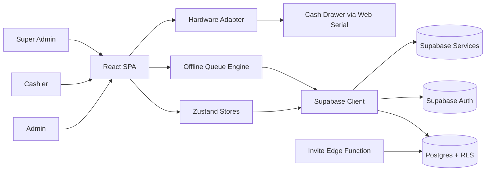
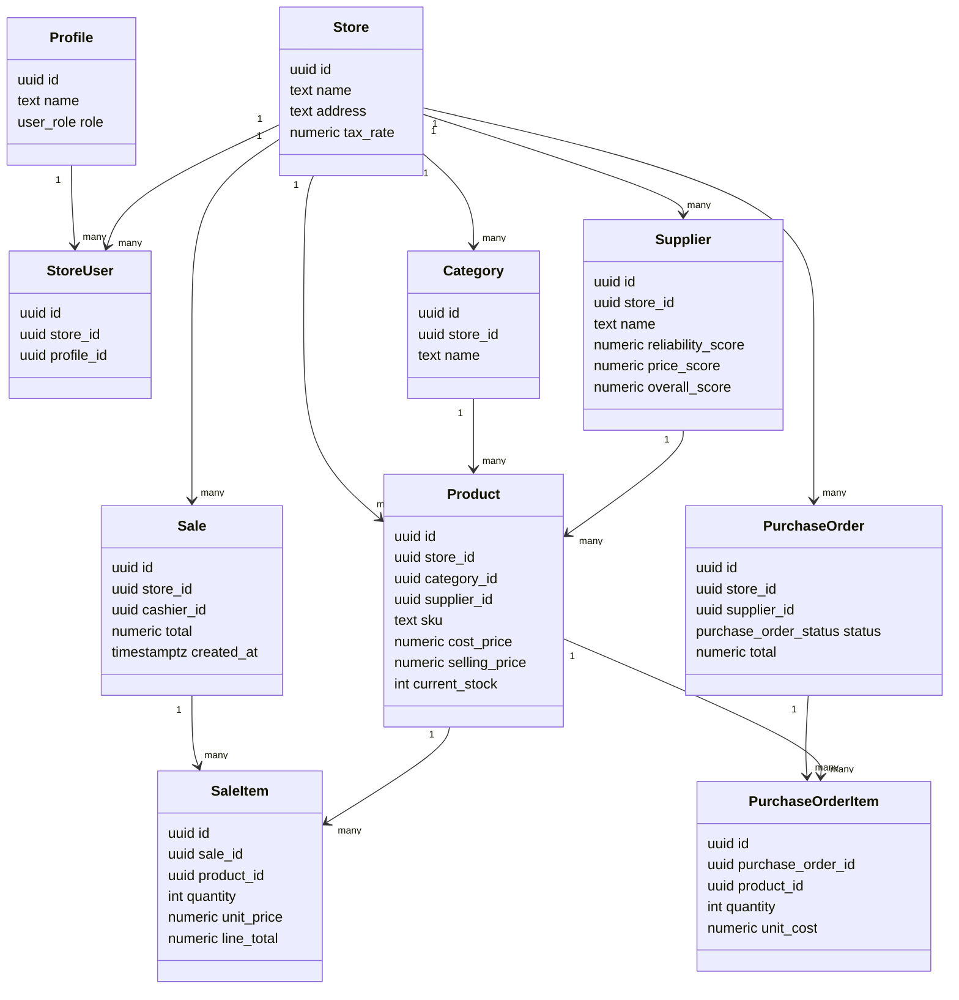
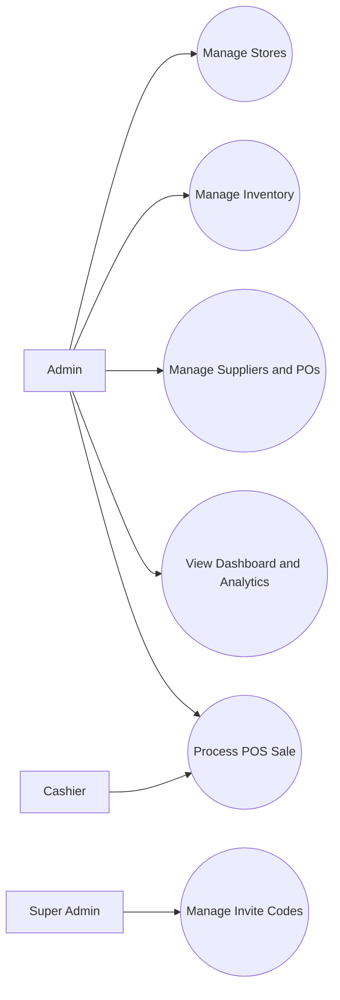
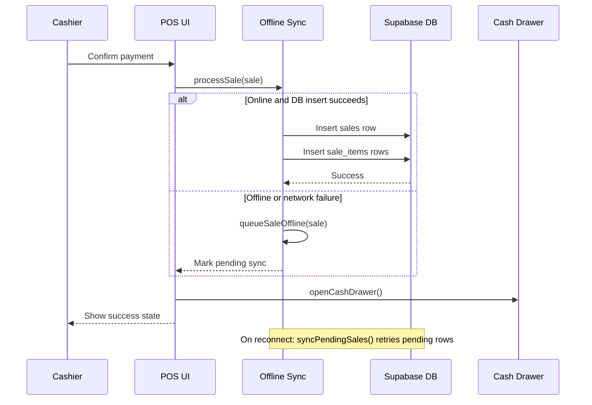
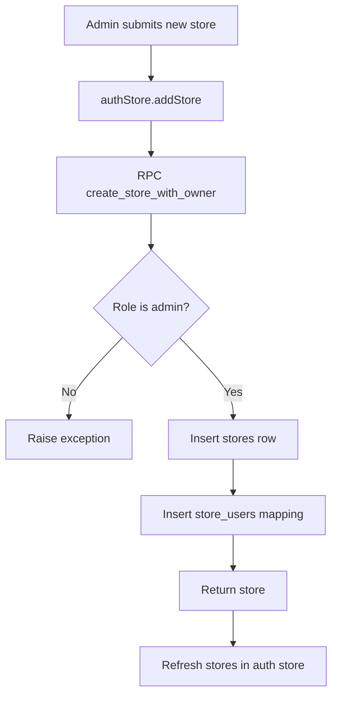
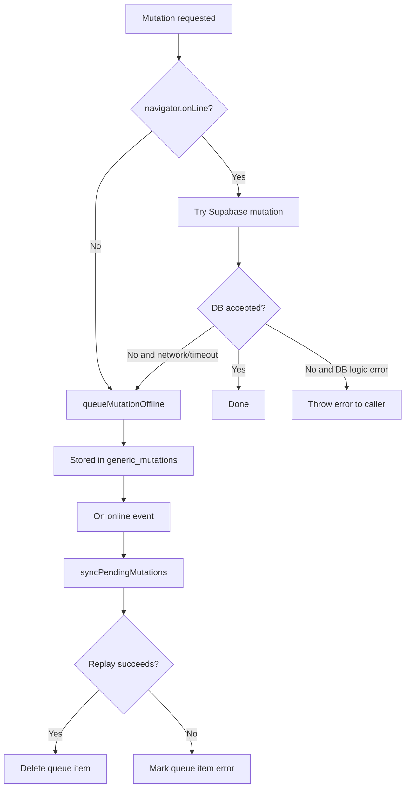
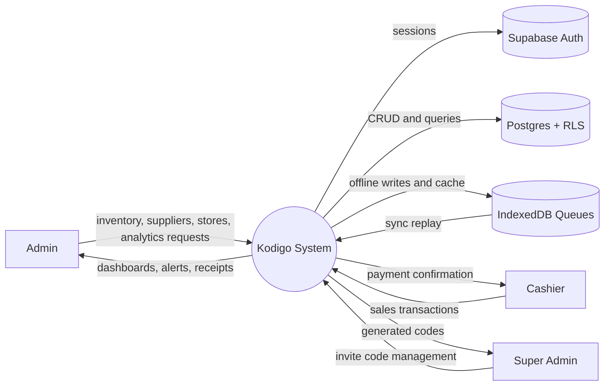
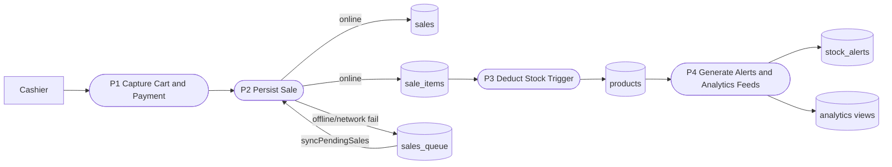
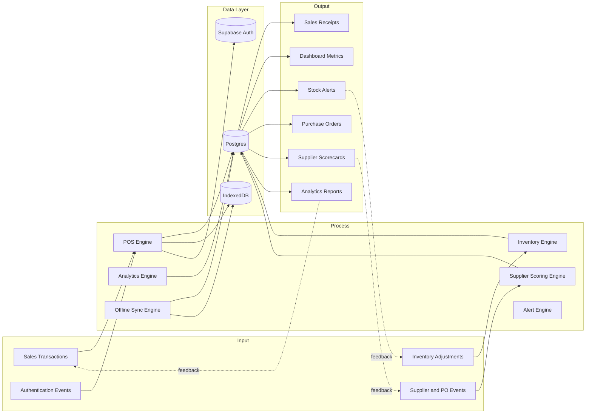

# Kodigo System Audit and Architecture Guide

Generated: 2026-04-19
Last reviewed: 2026-04-29
Version: 1.0
Scope: Full system audit (frontend, backend schema/migrations, RBAC, data flow, offline flow, hardware path)

## 1. Executive Audit Summary

Kodigo is a multi-store cloud POS and inventory platform with a React + Zustand frontend and a Supabase backend (Postgres + Auth + RLS + Edge Functions). The current implementation has evolved significantly through SQL migrations, and the migration chain (especially 07-17) is the authoritative source for runtime RBAC and tenancy behavior.

### 1.1 What is currently strong

- Multi-store data isolation exists via `stores`, `store_users`, and `store_id` scoping across operational tables.
- Route-level access control is implemented in the app shell (`RequireAuth`, `RequireAdmin`, `RequireSuperAdmin`, `RequirePOSAccess`).
- POS has resilient offline behavior through IndexedDB queues (`sales_queue`, `generic_mutations`) and reconnect sync.
- Stock deduction on sale is implemented at DB level via `trg_deduct_stock_on_sale` (migration 09).
- Store deletion and cascading paths were hardened with cascade-safe policies using `pg_trigger_depth()` (migration 16).

### 1.2 Key governance findings

- `supabase_schema.sql` is a baseline snapshot and does not represent final RBAC/tenant policy state after migrations.
- Final intended policy state is admin-only store CRUD; `super_admin` is scoped to invite governance.
- Super admin invite generation exists in both edge-function form and direct client insert path from the super-admin UI.
- There are active TypeScript compile/lint issues that should be cleaned before release.

## 2. Audit Scope and Evidence Sources

This guide was produced by auditing:

- Frontend runtime and routes:
  - `kodigo-ui/src/App.tsx`
  - `kodigo-ui/src/stores/*.ts`
  - `kodigo-ui/src/pages/*.tsx`
  - `kodigo-ui/src/components/pos/PaymentModal.tsx`
  - `kodigo-ui/src/lib/offline-sync.ts`
  - `kodigo-ui/src/lib/hardware.ts`
- Backend schema and security:
  - `supabase_schema.sql`
  - `migration_01_invite_codes.sql` through `migration_17_add_suppliers_updated_at.sql`
  - `supabase/functions/generate-invite/index.ts`
- Existing technical docs:
  - `FULL_AUDIT.md`
  - `FOR TECHNICAL VALIDATORS.md`
  - `KODIGO_AUDIT_ACTION_PLAN.md`
  - `KODIGO_CONCEPTUAL_FRAMEWORK_IMAGE_GUIDE.md`

## 3. Source of Truth Hierarchy

For architecture and RBAC decisions, use this order:

1. Latest migration chain (final behavior)
2. Runtime frontend implementation
3. Base schema snapshot (`supabase_schema.sql`) as initial reference only
4. Documentation files for intent and validation procedures

Important: `supabase_schema.sql` still reflects pre-multistore/pre-final-RBAC structures in several areas (for example `store_settings` singleton model and early broad policies). Final behavior depends on applied migrations.

## 4. System Architecture

## 4.1 Runtime layers

- Presentation Layer: React (Vite) SPA in `kodigo-ui`
- Application Layer: Zustand stores (auth, products, suppliers, cart, alerts)
- Integration Layer: Supabase JS client + IndexedDB queueing
- Data Layer: Postgres tables, RLS, functions, triggers, views
- Peripheral Layer: Web Serial API for cash drawer command

## 4.2 Architecture map



## 4.3 Core subsystems

- Auth and Role Resolution: `authStore.ts`, `profiles`, invite code trigger path
- POS Transaction Engine: `POSPage.tsx`, `cartStore.ts`, `PaymentModal.tsx`, `offline-sync.ts`
- Inventory and Product Management: `productStore.ts`, categories, stock adjustments
- Supplier and PO Engine: `supplierStore.ts`, purchase orders, supplier scoring triggers
- Alerting and Monitoring: `alertStore.ts`, dashboard and analytics pages
- Store Tenancy Management: stores/store_users mappings + `activeStoreId` frontend context

## 5. RBAC Guide (System of Permissions)

## 5.1 Implemented roles

- `admin`: full operational management within assigned stores
- `cashier`: POS-centric operational role within assigned store scope
- `super_admin`: system invite governance role (not store CRUD in final migrations)

Note: some legacy docs mention `manager`, but this role is not implemented in current enum/runtime.

## 5.2 Frontend route access matrix

| Route Area | Admin | Cashier | Super Admin |
|---|---|---|---|
| `/login`, `/register` | Yes | Yes | Yes |
| `/pos` | Yes (desktop preferred) | Yes | Redirected away |
| Admin shell pages (`/dashboard`, `/inventory`, `/suppliers`, `/analytics`, etc.) | Yes | No | No |
| `/super-admin` | No | No | Yes |

Enforced in: `kodigo-ui/src/App.tsx`

## 5.3 Backend RBAC and tenancy model

Primary enforcement primitives:

- `public.current_user_role()`
- `public.user_belongs_to_store(target_store_id)`
- `public.can_view_store_users(target_store_id)`

Primary policy model after latest migrations:

- Read access generally scoped by store membership.
- Write access for operational entities is admin-only within store scope.
- Store CRUD is admin-only and membership-scoped.
- Cascade-safe delete policies include `pg_trigger_depth() > 0` branch to avoid FK cascade failures.

Critical RBAC timeline:

- Migration 08/10/11 temporarily allowed `super_admin` broader operational scope.
- Migration 12 reverted `super_admin` from store operations.
- Migration 16 finalized admin-only store CRUD and hardened cascade behavior.

## 5.4 RBAC matrix by capability

| Capability | Admin | Cashier | Super Admin |
|---|---|---|---|
| Create/update/delete stores | Yes (assigned scope) | No | No (final) |
| Manage store-user mappings | Yes | No | No (final) |
| Product CRUD | Yes (store-scoped) | No | No (final) |
| Supplier CRUD | Yes (store-scoped) | No | No (final) |
| Create purchase orders | Yes (store-scoped) | No | No |
| Process sales | Yes | Yes | No |
| Generate invite codes | No | No | Yes |

## 5.5 Invite code governance

- Invite code table introduced by migration 01.
- `super_admin` role added by migration 02.
- Invite ownership scoping (`created_by`) enforced by migration 04.
- Edge function exists in `supabase/functions/generate-invite/index.ts`.
- Current SuperAdmin UI in `SuperAdminPage.tsx` also inserts invite codes directly from client using RLS-gated table access.

## 6. Data Model and Tenancy Guide

## 6.1 Core tenancy entities

- `stores`: tenant boundary records
- `store_users`: many-to-many mapping between users and stores
- `store_id` on operational tables for tenant isolation

## 6.2 Core operational entities

- Inventory domain: `categories`, `suppliers`, `products`, `stock_adjustments`, `stock_alerts`
- Sales domain: `sales`, `sale_items`
- Procurement domain: `purchase_orders`, `purchase_order_items`
- Identity domain: `profiles`, `invite_codes`

## 6.3 UML Class Diagram (Domain Structure)



## 7. UML Behavioral Views

## 7.1 Use-case view



## 7.2 POS sale sequence (online/offline)



## 8. CFD (Control Flow Diagrams)

Definition used here: CFD = Control Flow Diagram.

## 8.1 Auth initialization control flow

```mermaid
flowchart TD
    A[App start] --> B[authStore.initialize]
    B --> C{Has session user?}

    C -- No --> D[Set unauthenticated state]
    C -- Yes --> E[Fetch profile]
    E --> F[resolveRole(user, profile)]
    F --> G[Fetch stores by role]
    G --> H[Set activeStoreId]
    H --> I[isAuthenticated true]

    I --> J[Route guards decide destination]
```

## 8.2 Store creation control flow (admin)



## 8.3 Offline mutation control flow



## 9. DFD (Data Flow Diagrams)

## 9.1 DFD Level 0 (Context)



## 9.2 DFD Level 1 (Sales and inventory path)



## 10. Conceptual Framework (IPO + Feedback)

## 10.1 IPO model summary

- Input:
  - Sales transactions
  - Inventory adjustments
  - Supplier and PO events
  - Authentication and role assignments
- Process:
  - POS processing
  - Inventory and stock threshold logic
  - Supplier scoring and PO lifecycle updates
  - Analytics aggregation
  - Offline queueing and replay
- Output:
  - Receipts and transaction records
  - Dashboard KPIs and trends
  - Stock alerts and restocking recommendations
  - Supplier scorecards and rankings

## 10.2 Conceptual framework diagram



## 11. Current Technical Risks and Gaps

## 11.1 Build and code quality findings

- `npm run build` currently fails on TypeScript errors unrelated to documentation cleanup.
- Major build blockers include missing `storeId` fields in `src/lib/mock-data.ts`, unused imports/variables, fallback query result shape mismatches in dashboard/analytics/rankings pages, and an excessively deep IndexedDB type instantiation in `src/lib/offline-sync.ts`.
- `npm run lint` currently fails on parse errors in legacy patch scripts (`fix.cjs`, `patch.cjs`, `patch2.cjs`) plus broad `any` usage, unused variables, React hook warnings, and React Refresh export rules.

## 11.2 Architecture and security risks

- Base schema drift risk: teams may read `supabase_schema.sql` and miss critical migration overrides.
- Super-admin invite flow divergence: edge function exists, but current UI inserts invite codes directly from client.
- Transaction atomicity risk: sale header and sale items are inserted in separate API calls (no explicit single transaction RPC).
- Mutation replay conflict handling is basic; no robust conflict-resolution strategy for complex offline edits.
- Migration 06 grants broad schema privileges (`GRANT ALL` to anon/authenticated/service_role); RLS still applies, but this is a hardening point to re-evaluate.
- `RequireAuth` currently renders role-resolution diagnostics when profile lookup fails; hide or gate this before production release.

## 11.3 RBAC nuance to monitor

- Verify `stock_adjustments` insert policy intent: currently scoped by store membership but not role-constrained to admin in migration chain.

## 12. Validation Checklist

Use this checklist for pre-release validation:

1. Auth and role validation
   - Confirm login redirects by role (`cashier -> /pos`, `admin -> /dashboard`, `super_admin -> /super-admin`).
2. Tenant isolation
   - As admin in Store A, verify inability to write Store B data.
   - As cashier, verify inability to access admin pages and admin CRUD endpoints.
3. Store lifecycle
   - Create, update, delete a store as admin and confirm `store_users` mapping behavior.
4. Sales correctness
   - Execute POS sale online and verify inserts in `sales` and `sale_items`.
   - Verify product stock decreases through `trg_deduct_stock_on_sale`.
5. Offline sync
   - Create sale offline, confirm queue entry, reconnect, and verify replay success.
6. Invite governance
   - As super_admin, generate invite code and validate `created_by` scoping.
7. Policy hardening
   - Confirm no operational table writes are possible for super_admin role in final migration state.

## 13. Operational Guide for Maintainers

When changing RBAC, schema, or flows:

1. Apply schema changes in a new migration.
2. Update this guide sections:
   - RBAC matrix
   - UML/CFD/DFD diagrams if flow changed
   - Risks and checklist
3. Re-run role-based manual tests.
4. Keep `FOR TECHNICAL VALIDATORS.md` and this guide synchronized.

## 14. Quick Reference: Key Files

- Frontend routing and guards: `kodigo-ui/src/App.tsx`
- Auth/role/store session logic: `kodigo-ui/src/stores/authStore.ts`
- POS transaction modal: `kodigo-ui/src/components/pos/PaymentModal.tsx`
- Offline queue and replay: `kodigo-ui/src/lib/offline-sync.ts`
- Hardware integration: `kodigo-ui/src/lib/hardware.ts`
- Super-admin invite UI: `kodigo-ui/src/pages/SuperAdminPage.tsx`
- Invite edge function: `supabase/functions/generate-invite/index.ts`
- Baseline schema snapshot: `supabase_schema.sql`
- Migration chain: `migration_01_invite_codes.sql` ... `migration_17_add_suppliers_updated_at.sql`

---

This document is intended to be the primary technical guide for system understanding, RBAC governance, UML/CFD/DFD artifacts, and conceptual framework alignment.
